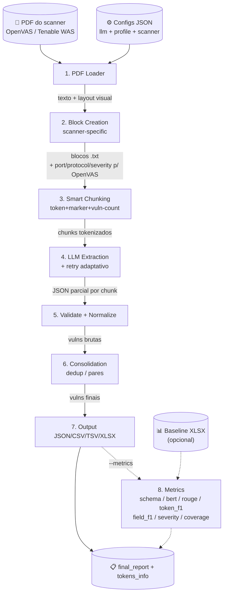

# Diagrama de Fluxo de Dados

Fluxo de dados do TMM: do PDF de entrada até o relatório final, com métricas opcionais. Diagramas em Mermaid; entradas, transformações e saídas são listadas explicitamente em cada estágio.

---

## 1. Visão geral (alto nível)



---

## 2. Estágios — entradas, transformação, saídas

### Estágio 1 — Carga do PDF
**Módulo:** [src/utils/pdf_loader.py](src/utils/pdf_loader.py)
**Entrada:** caminho do PDF (`args.input`).
**Transformação:** `load_pdf_with_pypdf2` extrai texto via PyPDF2; `save_visual_layout` serializa o layout do sumário (página 1) para uso posterior por scanners que dependem de contexto visual (OpenVAS).
**Saída:**
- `documents[0].page_content` → sumário/índice.
- `documents[1].page_content` → corpo do relatório (`extraction_text`).
- `visual_file` (arquivo de layout visual, .txt).

### Estágio 2 — Criação de blocos de sessão
**Módulo:** [src/utils/block_creation.py:9](src/utils/block_creation.py#L9), via [src/scanner_strategies/](src/scanner_strategies/) (Strategy Pattern).
**Entrada:** `extraction_text`, `visual_file`, `scanner` (nome).
**Transformação:**
1. `get_strategy(scanner)` resolve a estratégia (OpenVAS, Tenable WAS, ou fallback genérico).
2. Se a estratégia exige layout visual, `extract_visual_context(visual_file)` recupera tabela com (port, protocol, severity, host).
3. `strategy.create_blocks(text, temp_dir, context)` segmenta o texto em **blocos de sessão** (cada bloco = uma seção host/porta/protocolo/severidade), gravando arquivos em `temp_blocks_<llm>/`.

**Saída:** `session_blocks` — lista de dicts:
```python
{ 'file': 'temp_blocks_<llm>/block_<i>.txt',
  'port': int|None, 'protocol': str|None, 'severity': str|None }
```

### Estágio 3 — Chunking inteligente baseado em tokens
**Módulo:** [src/utils/chunking.py](src/utils/chunking.py) — função `smart_chunk_vulnerabilities`.
**Entrada por bloco:** texto do bloco + `marker_pattern` (do profile) + `max_chunk_size`, `reserve_for_response` (do `llm_config`) + `max_vulnerabilities_per_chunk` + `tokenizer` (de `get_tokenizer(llm_config)`).
**Transformação simultânea:**
- Quebra em markers do scanner (`NVT:` para OpenVAS, `VULNERABILITY <SEV> PLUGIN ID` para Tenable).
- Limite duro de tokens = `max_chunk_size − reserve_for_response`.
- Limite de N vulnerabilidades por chunk.
- Propagação de **`pre_marker_text`** (cabeçalho da seção) para todo subchunk gerado em redivisão, preservando contexto host/severidade.
- Validação defensiva: se `reserve_for_response ≥ max_tokens`, ajusta para 20% de margem.

**Saída:** lista de `TokenChunk` por bloco; `block_chunks_map = [(block, [chunks])]`.

### Estágio 4 — Extração via LLM com retry adaptativo
**Módulo:** [src/utils/block_creation.py:46](src/utils/block_creation.py#L46) (`extract_vulns_from_blocks`) → [src/utils/chunking.py](src/utils/chunking.py) (`retry_chunk_with_subdivision`, `build_prompt`).
**Providers suportados:** OpenAI (GPT-4/GPT-5), Groq (LLaMA 3/4, DeepSeek), Hugging Face, LM Studio, Ollama (local) — configurados via [src/configs/llms/*.json](src/configs/llms/).
**Entrada por chunk:** `TokenChunk`, `llm` (instância), `profile_config` (template de prompt), `max_chunk_size`, `tokenizer`.
**Transformação:**
1. `build_prompt(chunk, profile_config)` → injeta o conteúdo do chunk em `<report_content>...</report_content>` no template.
2. `count_tokens(prompt, tokenizer)` → `tokens_input`.
3. `retry_chunk_with_subdivision`:
   - Invoca o LLM (até `max_retries=3`).
   - Em falha (parse JSON, exceder contexto, resposta vazia), **subdivide o chunk dinamicamente** via `intelligent_chunk_redivision` e reprocessa cada subchunk.
   - Salva resposta crua em `llm_debug_responses/` se `debug_mode=True`.

**Saída:** `chunk_result = { 'vulnerabilities': [dict, ...], 'tokens_output': int }`.

### Estágio 5 — Validação, normalização e propagação de metadados
**Módulo:** [src/utils/block_creation.py](src/utils/block_creation.py) (lógica inline) + [src/model_management/](src/model_management/) (`validate_and_normalize_vulnerability`) ou [src/utils/cais_validator.py](src/utils/cais_validator.py) para profiles CAIS.
**Entrada:** lista de vulns brutas do LLM + metadata do bloco (`port`, `protocol`, `severity`).
**Transformação:**
- Achatamento de listas singleton (`[[{vuln}]] → [{vuln}]`) para LLMs como granite4 que envelopam.
- Filtro `isinstance(v, dict)`.
- Para profiles **não-Tenable**: se metadata do bloco tem port/protocol/severity, preenche campos ausentes/inválidos (`null`, `''`, port `0`) no vuln com os valores do bloco.
- Acumula em `all_vulns`.

**Saída:** `all_vulnerabilities: list[dict]` + `tokens_info: list[dict]` (gravado em `results_tokens/tokens_info_<pid>.json`).

### Estágio 6 — Consolidação / Deduplicação
**Módulo:** [src/scanner_strategies/consolidation.py](src/scanner_strategies/consolidation.py) — `central_custom_allow_duplicates`.
**Entrada:** `all_vulnerabilities`, `profile_config`, `allow_duplicates`.
**Transformação:**
- Se `allow_duplicates=False`: dedup por chave (Name + identification/host).
- Estratégia delega merge de campos quando há duplicatas (mantém port/protocol mais específico).
- Filtros finais: descarta vulns sem `Name` válido ou sem `description` válida → escreve `<output>_removed_log.txt` com os removidos para auditoria.

**Saída:** `final_vulns: list[dict]` válidas.

### Estágio 7 — Persistência e conversão
**Módulo:** [main.py:84](main.py#L84) (`save_results`) + [src/converters/](src/converters/).
**Entrada:** `final_vulns`, `output_file`, `args.convert`.
**Transformação:** grava `output.json`; `execute_conversions` gera CSV/TSV/XLSX (XLSX é forçado se houver avaliação).
**Saída:**
- `<out>.json`, `<out>.csv`, `<out>.tsv`, `<out>.xlsx`.
- `<out>_removed_log.txt` (vulns descartadas).
- `results_tokens/<out>_<llm>_tokens.json` (renomeado a partir de `tokens_info_<pid>.json`).

### Estágio 8 — Métricas (opcional)
**Métodos registrados** (`METRIC_SCRIPTS` em [main.py:200](main.py#L200)): `schema`, `bert`, `rouge`, `token_f1`, `field_f1` (chave atual no código: `entity`), `severity`, `coverage`.
**Módulos:**
- `bert` / `rouge` / `token_f1` → runner unificado [metrics/pipelines/compare_extractions.py](metrics/pipelines/compare_extractions.py) com `--scorer {bertscore,rouge_l,token_f1}`.
- `field_f1` → [metrics/entity/compare_extractions_entity.py](metrics/entity/compare_extractions_entity.py) — F1/precision/recall em campos determinísticos (cvss, severity, port, protocol, plugin).
- `schema` / `severity` / `coverage` → [metrics/pipelines/{schema_check,confusion_severity,coverage}.py](metrics/pipelines/).

**Disparado se:** flag CLI `--metrics ...` (popula `args.evaluation_methods`) e `args.baseline_path` presentes.
**Ordem e dependências** ([main.py:213](main.py#L213) `ALL_METHODS_ORDER`): `schema → bert → rouge → token_f1 → field_f1 → severity → coverage`. `field_f1`/`severity`/`coverage` consomem pares casados produzidos por `bert`/`rouge`; se nenhum produtor for pedido, `bert` é auto-adicionado.
**Entrada:** baseline XLSX + extraction (JSON nativo ou XLSX) + `--llm`. As pipelines aceitam ambos via [metrics/common/io.py](metrics/common/io.py).
**Transformação:** quando rodado por `run_experiments.py`, métricas são adiadas para um post-pass único via [tools/run_metrics.py](tools/run_metrics.py) — bert/rouge in-process serial (modelo carrega 1×), demais em subprocess paralelo. Aggregator [`metrics.aggregators.multi_run`](metrics/aggregators/multi_run.py) roda no fim.
**Saída:** arquivos de métricas no diretório de cada run + `aggregated_metrics.xlsx` na raiz de `--output-dir`.

### Estágio 9 — Relatório final
**Módulo:** [src/utils/reporting.py](src/utils/reporting.py) — `generate_final_report`.
**Entrada:** `run_stats`, `tokens_dir='results_tokens'`, `timing_report`, `failures`.
**Saída:** Markdown consolidado (`final_report_<ts>_<uuid>.md`) com seções de timing, token usage & cost, runs per baseline, failures. Salvo no `output_dir`. Suprimido quando `--run-experiments` está presente (orquestrador escreve um único report no fim).

---

## 3. Paralelismo (a contribuição central da branch)

Há **dois eixos de paralelismo** distintos:

### 3a. Paralelismo entre execuções — [tools/run_experiments.py](tools/run_experiments.py)

```mermaid
flowchart TB
    M[run_experiments.py] -->|agrupa por endpoint| GR[provider_groups]
    GR -->|ThreadPoolExecutor<br/>max_workers=len(groups)| W1[Worker: OpenAI runs]
    GR --> W2[Worker: Groq runs]
    GR --> W3[Worker: DeepSeek runs]
    GR --> W4[Worker: Local/Ollama runs]
    W1 -->|subprocess<br/>main.py --llm gpt5 --input X.pdf| MAIN1[main.py instance]
    W2 -->|subprocess| MAIN2[main.py instance]
    W3 -->|subprocess| MAIN3[main.py instance]
    W4 -->|subprocess| MAIN4[main.py instance]
    MAIN1 --> CKPT[(run_checkpoints_*.json)]
    MAIN2 --> CKPT
    MAIN3 --> CKPT
    MAIN4 --> CKPT
```

**Entrada:** matriz (PDFs × LLMs × N runs).
**Transformação:** `config_loader.provider_group_key` agrupa LLMs por **domínio do endpoint** (não por provider lógico) — execuções dentro do mesmo grupo compartilham rate limit; entre grupos podem rodar em paralelo. `ThreadPoolExecutor(max_workers=len(provider_groups))` dispara um worker por grupo; cada worker chama `main.py` via `subprocess`.
**Saída:** resultados por execução + `run_checkpoints_<…>.json` permitindo retomada.

### 3b. Isolamento intra-execução

- Cada execução de `main.py` usa `temp_dir=temp_blocks_<llm>` (linha [main.py:290](main.py#L290)) — diretórios de blocos temporários são particionados por LLM, **evitando colisão** quando múltiplas instâncias rodam em paralelo no mesmo PDF.
- `tokens_info_<pid>.json` usa o PID para isolamento por processo.

---

## 4. Resumo: entradas e saídas globais

| Tipo | Item | Origem / Destino |
|------|------|-------------------|
| **In** | PDF do scanner | `args.input` |
| **In** | Profile JSON (scanner) | `src/configs/scanners/*.json` |
| **In** | LLM JSON | `src/configs/llms/*.json` |
| **In** | Prompt template | `src/configs/templates/*.txt` |
| **In** | Baseline (opcional) | `args.baseline_path` (XLSX) |
| **Intermediário** | Layout visual | `<pdf>_visual.txt` |
| **Intermediário** | Blocos de sessão | `temp_blocks_<llm>/block_*.txt` |
| **Intermediário** | Chunks tokenizados | em memória (`TokenChunk`) |
| **Intermediário** | Resposta crua do LLM | `llm_debug_responses/` (se `--debug`) |
| **Out** | Vulns extraídas | `<output_dir>/<base>.json` |
| **Out** | Conversões | `<base>.csv`, `<base>.tsv`, `<base>.xlsx` |
| **Out** | Vulns removidas | `<base>_removed_log.txt` |
| **Out** | Tokens / custo | `results_tokens/<base>_<llm>_tokens.json` |
| **Out** | Relatório final | `<output_dir>/final_report_*.md` |
| **Out** | Métricas | `<output_dir>/{schema,bert,rouge,token_f1,field_f1,severity,coverage}_*` |
| **Out** | Checkpoint (batch) | `run_checkpoints_<…>.json` |
